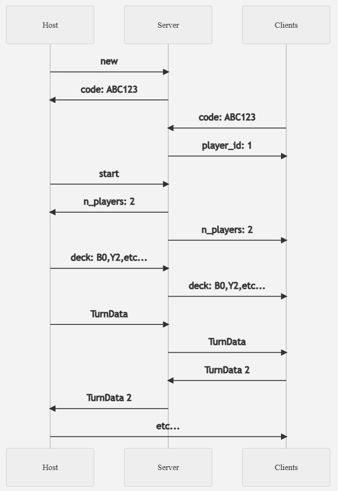
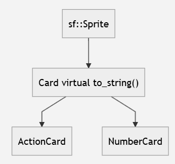

# [CPT_S 122 Final Project: Uno](https://uno.cole.ws)
> Washington State University Fall 2024 
> Professor Andy O'Fallon 
> Cole Wilson (Lab 8) & Shane Ganz (Lab 2)

An implementation of server-networked Uno in C++ using SFML.

#### [Video Demo:](https://www.youtube.com/watch?v=0Wnnqhm2Nsg)

## Installation
**Binary**: Download the [latest release](https://github.com/cole-wilson/uno/releases).

**[Source](https://github.com/cole-wilson/uno)**: `git clone https://github.com/cole-wilson/uno`

## Instructions
The game is played just as the physical card game Uno is. A "Host" player starts
a game on their computer using the `Host` menu option. Next, all other players
(up to about 10), join using the `Join` button and the randomly generated 6-digit
code from the Host.

From then on, the game is played on a virtual tabletop. Your cards are displayed
in front of you, and you can select them using your mouse or arrow keys.
To draw a card, use the `D` key, or click on the draw pile. To play the selected card,
click on it, or press `Space` or `Return`.

The number of cards each player has, along with who's turn it is,
is displayed in the upper right corner of the window. To win, first get rid of all
but one of your cards (in which case the phrase "Uno!" is played over the speakers),
and then play that last card to win. You lose if someone else gets rid of all of their cards
before you do.

## Code Overview
The code consists of 3 major parts: the grahics thread, and the game logic thread, and the server, which are detailed
below.

### Graphics Thread:
The main SFML thread has to run in the main thread to recieve window events. All of the graphics are housed
within the [`GraphicsMain`](./Uno/GraphicsMain.h) class. This class contains a singleton instance of the [`Game`](./Uno/Game.h)
class (which is a `friend` of `GraphicsMain`), which essentially shares state between the two threads. To see
implementation details, view the line comments in [`GraphicsMain.cpp`](./Uno/GraphicsMain.cpp).

The code is split into two parts: event handling and window drawing. The event handling listens for things like
mouse clicks, keypresses, etc., and updates the game state accordingly. The window drawing handles drawing [`Card`](./Uno/Card.h)
objects, which inherit from `sf::Sprite`, as well as drawing the [`Menu`](./Uno/Menu.h) screen and various text
info messages.

For wild cards, they are initially stored as an [`ActionCard`](./Uno/ActionCard.h) of type `WILD` and color `WILD_COLOR`. Once the
user chooses a color, it changes the color attribute, but keeps the `WILD` action type.

### Game Logic Thread:
The game logic thread handles communication with the server via SFML sockets, as well as managing the turn-based logic
and instructing the graphics thread what to do. The game thread consists of the [`Game::mainloop`](./Uno/Game.h) method which
has access to several [`Deck`](./Uno/Deck.h)s of [`Card*`](./Uno/Card.h)s (which are either [`ActionCard*`](./Uno/ActionCard.h)s or
[`NumberCard*`](./Uno/NumberCard.h)s). The Deck class wraps the STL `deque` structure and provides access to common card
deck actions such as draw, put, and read.

Because the server communication sockets (through the [`Server`](./Uno/Server.h) class) are blocking, we can't put
them in the main thread. However, we need to wait for actions from the non-blocking user events (such as choosing a card) from
the graphics thread. We do this using mutexes, locks, and condition variables (see file for details). When we are waiting on the
graphics thread, we can call a `wait` method to block until the graphics thread calls the `release` method.

The [`Deck`](./Uno/Deck.h)s and [`Card`](./Uno/Card.h)s are sent using their `to_string()` method, which serializes them
into a string for sending over the server. For example, a Deck consisting of a Blue Zero, and a Yellow 2 would look like:
`B0,Y2`.

To send turn data to other clients, and to recieve it, the [`TurnData`](./Uno/TurnData.h) class is used to serialize the data sent across the
network. The Turndata consists of the following seperated by a newline `\n`:
 - number of cards drawn by the player
 - number of cards in players hand at end of their turn
 - the index of the next player
 - the direction of play (`1` or `-1`)
 - the `Card.to_string()` that was played (or `no` for pass)

### Server:
The server code is written in Python 3.13 in [`server/main.py`](./server/main.py), and contains
two parts. The code for the webserver displayed at [uno.cole.ws](https://uno.cole.ws) uses the Flask
web app library, and provides uptime statistics and serves this README file as a sort of landing page.

The second, more complex, part of the server code is an implementation of a threading TCP socket server using
Python's `socketserver` library. The code listens for incoming new game connections, and stores each game in a dictionary
mapping of join codes to game data. After the initial setup stage, it echos each message from a client back to
all other clients with the same join code. *Essentially, the server acts as a relay to splilt messages coming to it
across all the other clients.* To see implementation details, view the comments in the file.

The server is packaged within a Docker image (see [`Dockerfile`](./Dockerfile)) and deployed to a [Caprover](https://caprover.com/)
instance hosted by Cole on an Ubuntu Server Oracle VPS "Always Free" instance. Caprover handles deployment of several Docker images
and generates SSL certificates for them as well. The webserver is bound to listen on TCP port `8080` on all addresses, and the
Uno socket server is bound to all addresses on TCP `9999`. The code is deployed using GitHub's CI/CD webhook feature, so
every push to the main branch triggers a redeploy of the server.

## Class Overview (Polymprphism and Inheritance)
The [`NumberCard`](./Uno/NumberCard.h)s and [`ActionCard`](./Uno/ActionCard.h)s are use polymorphism and inheritance from
[`Card`](./Uno/Card.h)s. They each share the same `CARD_COLOR` property, but their behavior varies depending on whether or not
they are a number card or action card. We can treat them as plain `Card`s in `Deck`s but as their subtypes when we are performing
actions with them. A UML diagram of the entire Card class structure is shown below:

### All Classes and Files
| class | source | description |
|-------|--------|-------------|
|[`ActionCard.h`](./Uno/ActionCard.h)|[`ActionCard.cpp`](./Uno/ActionCard.cpp)|Derived class of Card for Action Cards.|
|[`Card.h`](./Uno/Card.h)|[`Card.cpp`](./Uno/Card.cpp)|Class inheriting from `sf::Sprite` acting as a base class for Number and Action cards.|
|[`Deck.h`](./Uno/Deck.h)|[`Deck.cpp`](./Uno/Deck.cpp)|Wrapper of the STL `std::deque` class to contain a series of `Card*` objects for draw pile, discard pile, or the player's hand.|
|[`Game.h`](./Uno/Game.h)|[`Game.cpp`](./Uno/Game.cpp)|The main game logic thread that handles blocking communication and turn logic. Uses threading and locks to communicate with `GraphicsMain`.|
|[`GraphicsMain.h`](./Uno/GraphicsMain.h)|[`GraphicsMain.cpp`](./Uno/GraphicsMain.cpp)|The main graphics thread handling the window event loop and drawing all objects and sprites on the screen. Interacts with `Game::mainloop` thread.|
|[`Menu.h`](./Uno/Menu.h)|[`Menu.cpp`](./Uno/Menu.cpp)|Graphics class for drawing the join/host/exit menu and handling join code input.|
|[`NumberCard.h`](./Uno/NumberCard.h)|[`NumberCard.cpp`](./Uno/NumberCard.cpp)|Derived class of Card for Number Cards.|
|[`Server.h`](./Uno/Server.h)|[`Server.cpp`](./Uno/Server.cpp)|Handles interactions with the server through `sf::Socket`.|
|[`SoundPlayer.h`](./Uno/SoundPlayer.h)|[`SoundPlayer.cpp`](./Uno/SoundPlayer.cpp)|Wrapper for `sf::Sound` and sound buffer reading from filename.|
|[`TestCases.h`](./Uno/TestCases.h)|[`TestCases.cpp`](./Uno/TestCases.cpp)|5 test cases for common operations.|
|[`TurnData.h`](./Uno/TurnData.h)|[`TurnData.cpp`](./Uno/TurnData.cpp)|Class for serializing and deserializing turn data and game state.|
||[`main.cpp`](./Uno/main.cpp)|Main entrypoint for the program.|
|[`server/`](./server)|[`Dockerfile`](./Dockerfile)|The Dockerfile for running the server code on a hosted Caprover instance.|
|[`server/`](./server)|[`main.py`](./server/main.py)|The main server entrypoint for all server code.|
|[`server/`](./server)|[`index.html`](./server/index.html)|Template HTML file for the webserver.|
|[`sounds/`](./Uno/sounds)|[`*.wav`](./Uno/sounds)|Sound resource files.|
|[`cards/`](./Uno/cards)|[`*.png`](./Uno/cards)|Card images (see credits below).|
||[`installforge.ifp`](./installforge.ifp)|InstallForge config file (see below).|
||[`exelogo.ico`](./exelogo.ico)|Executable icon file (Windows).|
||[`helvetica.ttf`](./Uno/helvetica.ttf)|Helvetica font file.|
||[`unologo.png`](./Uno/unologo.png)|Uno game logo for menu.|

## Packaging
The Windows executable installer was created using [InstallForge](https://installforge.net/) using the [`installforge.ifp`](./installforge.ifp)
configuration file. It shows a license agreement, copies the DLLs, resource files, and executable to `Program Files`, and creates
shortcuts. (See the [Installation](#Installation) section above for a download of the installer.)

## Image Credits
The Uno playing card images are taken directly from
[celsiusnarhwal/uno](https://github.com/celsiusnarhwal/uno) with some minor modifications.

&copy; Cole Wilson and Shane Ganz 2024